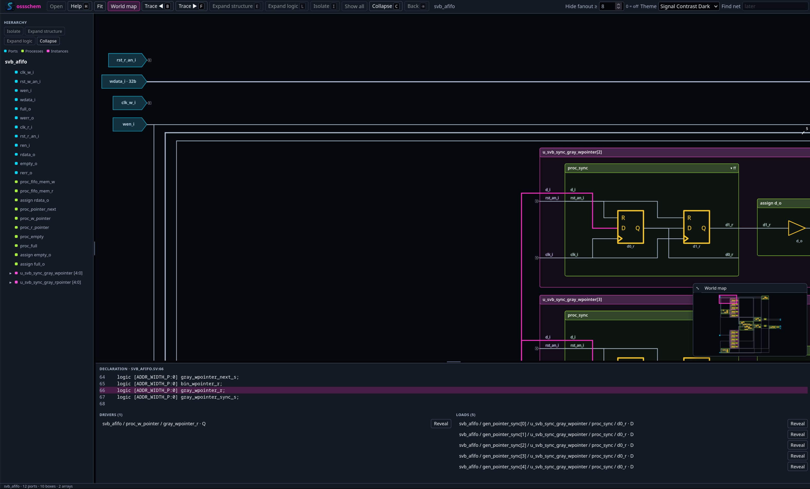

# ossschem - A snappy, cool and feature-rich open source RTL Schematic Tracer

<p align="center">
  
</p>

ossschem is an open-source RTL schematic tracer - for now for (System-)Verilog designs that are compileable with Verilator. It reads Verilator's `--json-only` output directly and turns it into an interactive hierarchical schematic without requiring a separate netlister. Start with process and instance structure, expand gates and expressions when needed, and trace signals forward or backward through the design.

The viewer combines schematic navigation with source mapping: select a port, pin, wire, or component to inspect its declaration, expression, drivers, loads, and source code. It is designed for exploring large RTL designs while keeping the initial view readable and focused.

It is planned to support other input formats and also waveform coss-probing.



## Quick start

```bash
npm install
npm run dev
```

Open [http://localhost:5173](http://localhost:5173) in a browser. The bundled viewer loads the `svb_afifo` example from the checked-in fixture data.

In the schematic, click to select and use **Fit** to restore the full view. Double-click a process or instance, or press `E`, to expand its structure; press `L` to expand its logic. Select a pin or wire and press `F` or `B` to trace forward or backward. Use **Isolate** or `I` to focus on one component, and `Backspace` to return to the parent view. The **Help** button or `H` shows all shortcuts.

v1 golden design is `svb_afifo` from the adjacent `sv_base_lib` tree. Architecture and acceptance scenes: [`docs/DESIGN.md`](docs/DESIGN.md).

## Development

```bash
npm install
npm test            # typecheck + AFIFO JSON fixture smoke
npm run dev         # Vite app at http://localhost:5173
npm run fixture:dump  # regen Verilator --json-only (needs Verilator 5.046)
```

Requires Node 20+. The viewer opens Schematic IR (`.ir.json`) only. `npm run ossschem -- dump --fixture svb_afifo` rebuilds the golden IR. CI never runs Verilator — it uses `fixtures/svb_afifo/verilator/`.

Canvas: pan (middle-drag / Alt-drag), zoom (wheel), **Fit**, click to select, **double-click** or `E` to expand a process (gates) or instance in place, or explode a generate array, `L` to expand logic beneath the selection, **Enter** on an instance drills in, **Backspace** / **Back** returns. Click a wire, pin handle, or pin label to select an individual signal. `B`/`F` trace its drivers/loads to the next visible boundary, including inside expanded instances. Shift+B/F traces into the selection. `C` / **Collapse** collapses a selected container; Escape clears tracing. Clocks and resets are stubbed, not drawn as a tree.

Use **Isolate** (or `I`) on a canvas selection, or select a sidebar component and use the action buttons above the tree, to start a focused schematic. Sidebar disclosure arrows browse modules and generate-array members independently of the canvas. **Expand structure** opens instances and arrays throughout the selected subtree; **Expand logic** also opens all always/assign boxes beneath it. Both actions only add detail, so repeating them never closes anything. Select the module name at the top of the tree to apply either action to the whole module. **Trace ◀/▶** (`B`/`F`) adds the next connected drivers or loads. **Show all** restores the complete module.

Pins have separate inside/outside arrow handles wherever connectivity remains hidden. Double-click an inside handle to reveal only that signal’s next internal driver or load, in either the complete module view or an isolated view; double-click an outside handle to reveal neighboring drivers or loads. The arrow follows signal direction: on an input, outside traces backward and inside traces forward; on an output, these reverse. Each handle disappears only when its own connections are visible. Use **Expand logic** to reveal the remaining contents of a partially traced block. Double-clicking a box body toggles its immediate contents. Primary inputs stay left and outputs stay right; blue ports, green processes/assignments, and purple instances distinguish the component types.

The source pane sits beneath the schematic for long RTL lines, alongside the full-height hierarchy pane. Drag its horizontal divider to change its height; the hierarchy divider adjusts the left sidebar width. Sizes are remembered locally. Double-click a divider to reset it, or focus it and use the arrow keys (Shift for larger steps). Signal expansion frames the trace origin, connecting wires, and revealed components with nearby context.

Drag with the left mouse button on empty canvas or an expanded box's empty interior to zoom into a rectangle; press Escape to cancel. Pan with the middle mouse button, Alt-drag, or Space-drag. The mouse wheel zooms around the pointer, and **Fit** restores the overall view. Primary inputs and outputs point right along the data flow; inout port shapes point both ways. Selected and traced components use strong fills and outlines that stay visible when zoomed out.

Selecting a port, pin, or wire shows its signal declaration when available, or the source of the expression that produces it. **Drivers** and **Loads** list connected components, including hidden ones. **Reveal** displays the route to just that connection; **Expand logic** also opens the connected component's logic. Expanded boundaries are traversed rather than listed as extra drivers or loads.

Select a wire and use **Collapse** (or `C`) to hide that branch and restore its endpoint trace handles. Other branches stay visible. Trace from either end or use **Reveal** in the source pane to bring it back; explicit component expansion also restores manually hidden internal branches.

The toolbar's **Hide fanout ≥** setting controls automatic wire hiding per module (default 8 loads; 0 disables this limit) and is remembered locally. Outer clock/reset connections stay hidden until traced. Inside expanded instances, clock/reset connections follow the local fanout limit, so small internal connections are visible even when the outer net is hidden. Explicitly traced wires remain visible when the setting changes.

Multi-bit connections use thicker wires and slash/count markers (for example, `32` for a 32-bit bus). Port labels also include bit counts, and sliced connections show the width of the selected bits.

The toolbar theme selector defaults to Current Dark. It also offers Current Light, Tokyo Night/Day, Nord/Arctic Light, Solarized Dark/Light, saturated EDA Dark/Light palettes, EDA Classic Dark/Light palettes with a black canvas and cyan nets, Signal Contrast Dark/Light palettes with bright, strongly separated family colors, Catppuccin Mocha/Latte palettes, Neon Arcade Dark/Light palettes with playful contrasting accents, Fluorescent Dark/Light palettes with high-saturation blacklight colors, 80s X Dark/Light palettes with dusty pink, mustard, gray, slate, and beveled controls, and Monokai Dark/Bright palettes. Monokai Bright is grouped with the light themes and uses a neutral cream surface. The choice is remembered locally so the viewer keeps the selected appearance across reloads.

The **World map** toolbar toggle shows or hides a navigation overview at the schematic's bottom right. It follows the currently explored schematic, including off-screen components; isolated views show only their isolated contents. Drag the view box to pan without changing zoom, or click elsewhere on the map to recenter. Drag the map's upper-left corner to resize it, up to 30% of the schematic viewport area. Its size and visibility are remembered locally. With the map focused, arrow keys pan; with its resize handle focused, arrow keys adjust size and Enter resets it (double-clicking the handle also resets it).

The ossschem logo opens an About screen with the project banner. The **Help** button or `H` opens the shortcut and operations guide; pressing `H` again or `Escape` closes it.

Press **F** or **B** repeatedly (or use the Trace buttons) to advance a signal's cone one step at a time across all unfinished branches. The origin stays selected, the accumulated cone remains highlighted, and dashed outlines mark the current endpoints. Forward tracing continues through registers to Q; backward tracing through registers follows D and EN, excluding clock/reset controls. Explicitly selecting a clock or reset pin still allows tracing that signal. Closed processes and instances open only along the followed paths, and visited pins prevent feedback loops from retracing forever. The status bar reports the step and active branches, or completion. Changing direction restarts at the origin; selecting another element or pressing Escape clears the active trace. The camera follows the latest step rather than fitting the whole accumulated cone.

## License

MIT.
