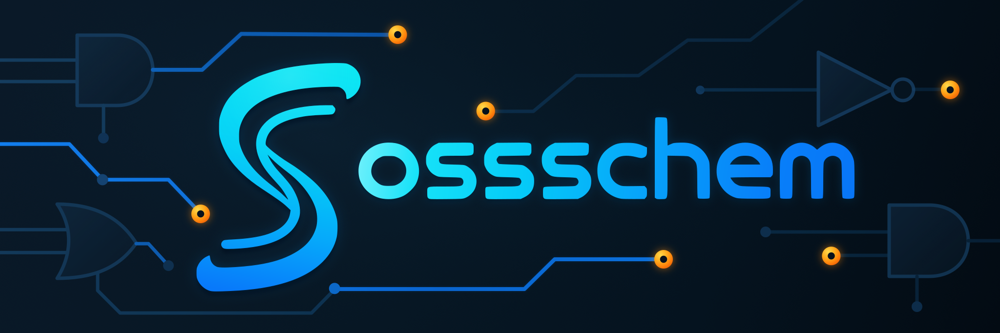

<p align="center">
  
</p>

# ossschem — RTL schematic tracer

Opens an interactive schematic of a (System)Verilog design inside VS Code:
process and instance structure first, gates and expressions when you ask for
them, signals traced forward and backward through the hierarchy, and the
declaration, drivers and loads of whatever is selected in a source pane
beneath it.

With [vaporview](https://marketplace.visualstudio.com/items?itemName=lramseyer.vaporview)
installed it also works with a waveform dump: signals go from the schematic to
the waveform, a signal in the waveform is revealed in the schematic, and every
wire can be labelled with its value at the cursor.

## 1. Build a schematic from your design

The extension opens a `schematic-ir.json`, which the `ossschem` command writes
from your RTL. It runs Verilator's `--json-only` elaboration, so the design has
to elaborate with **Verilator 5.046 or newer** — nothing is simulated and no
C++ is generated. The version is detected, recorded in the IR, and reported
when it is older than that.

```bash
ossschem build --top my_top --out-dir build/schematic rtl/*.sv
```

That writes `schematic-ir.json`, `sources.json` and a standalone `index.html`
into `build/schematic`. Useful flags:

- `--sources path/to/rtl` — add source text that is not on the Verilator
  command line; repeatable. Without it, a file that was only included shows no
  source in the pane.
- `--verilator /path/to/verilator` — when it is not on `PATH`.
- `--open` — open the standalone page in a browser instead of, or as well as,
  using VS Code.

In a Makefile, next to the simulation that produces the dump:

```make
TOP           := my_top
RTL           := $(wildcard rtl/*.sv) $(wildcard tb/*.sv)
SCHEMATIC_DIR := build/schematic

.PHONY: schematic
schematic: $(SCHEMATIC_DIR)/schematic-ir.json

$(SCHEMATIC_DIR)/schematic-ir.json: $(RTL)
	ossschem build --top $(TOP) --out-dir $(SCHEMATIC_DIR) $(RTL)
```

Getting the `ossschem` command, and the rest of the install:
[INSTALL.md](https://github.com/markusdd/ossschem/blob/main/INSTALL.md).

## 2. Open it

Open `schematic-ir.json` — clicking it in the explorer is enough. The extension
is the default editor for it, and for any `*.ir.json`, so the schematic is what
you get rather than the JSON text.

When the JSON itself is the question, **Reopen Editor With… → Text Editor** on
the tab shows the file; **ossschem: Open schematic** (or the title bar button)
switches back.

## 3. Read it

Click to select; **Fit** restores the whole view. Double-click a process or
instance (or press `E`) to expand its structure in place, `L` to expand its
logic into gates and flip-flops, `I` to isolate one component, `C` to collapse
one, and `Backspace` to go back. Select a wire or pin and press `F` or `B` to
trace its loads or drivers, repeatedly to advance one step at a time.

Press `H` for the full list of shortcuts and operations.

Unpacked arrays are drawn as one wire marked `4×8b` into a splitter, with one
branch per element labelled `[0]`, `[1]`, and so on.

## 4. Waveform cross probing

Requires vaporview, with a dump open.

**Schematic → waveform.** Select a signal and press `W`, or use the
**Waveform** button. The name is checked against the dump before it is added:
vaporview accepts a name it cannot resolve without complaining, so an
unverified spelling would look exactly like success. Selecting a whole unpacked
array asks which elements to add — all of them for a small one, otherwise the
first, or type an index, a range (`0-7`) or a list (`0,2,5`). Selecting one
branch off a splitter adds just that element.

**Waveform → schematic.** Right-click a signal in the waveform or in its
netlist tree and choose **Reveal in schematic**. The instances between the
current scope and that signal open in place, the signal is highlighted and
framed, and its declaration, drivers and loads appear in the source pane. The
scope on screen does not change, so the answer arrives in the context the
question was asked in.

Both directions are deliberate rather than automatic: scrubbing the cursor
moves the waveform selection around, and a schematic that followed it would not
stay still long enough to read.

**Values at the cursor.** Toggle **Values** in the toolbar to label every wire
on screen with its value at the waveform cursor; the labels follow the cursor
as it moves. Values read as Verilog writes them (`1'b1`, `8'h0f`), with unknown
bits in binary (`4'b010x`), and a signal that changes at the cursor shows the
step across it (`8'h0f→a3`). An unpacked array has no single value, so the wire
into its splitter carries none, but each branch off it does. The value of the
selected signal lights up with it and is written out on the heading of the
source pane.

**Which dump.** The **Waveform** picker at the top of the sidebar names the
dump everything reads and writes, and switches it when several are open. It is
settled once — from the one on screen — and then left alone, so the target does
not move between one operation and the next.

## Commands

| Command | What it does |
| --- | --- |
| `ossschem: Open schematic` | Show a `schematic-ir.json` as a schematic, from the text editor |
| `ossschem: Reveal in schematic` | Show the waveform's selected signal (context menus) |
| `ossschem: Link selection to waveform viewer (toggle)` | Stop or resume sending signals to vaporview |
| `ossschem: Show log` | Every cross-probing step, in an output channel |
| `ossschem: Diagnose waveform probing` | What vaporview knows about the last signal picked |

If a signal does not appear in the waveform, the diagnostic is the first thing
to check: it prints the spellings vaporview recognises for it.
